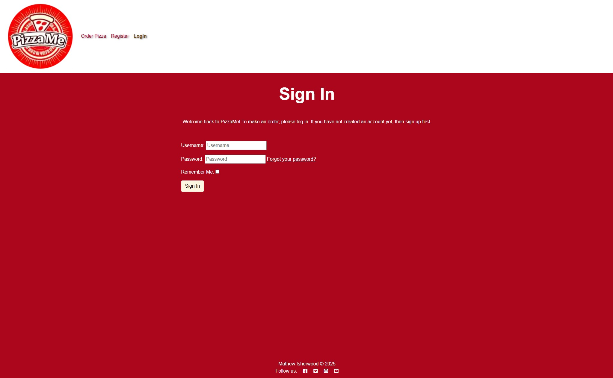
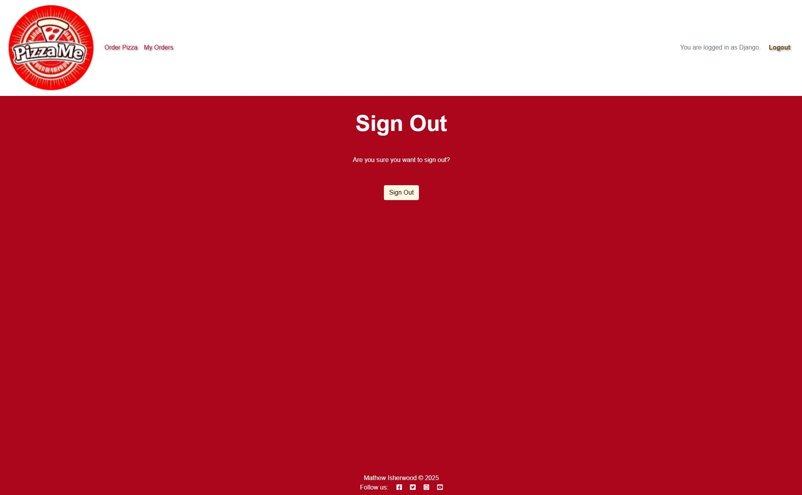
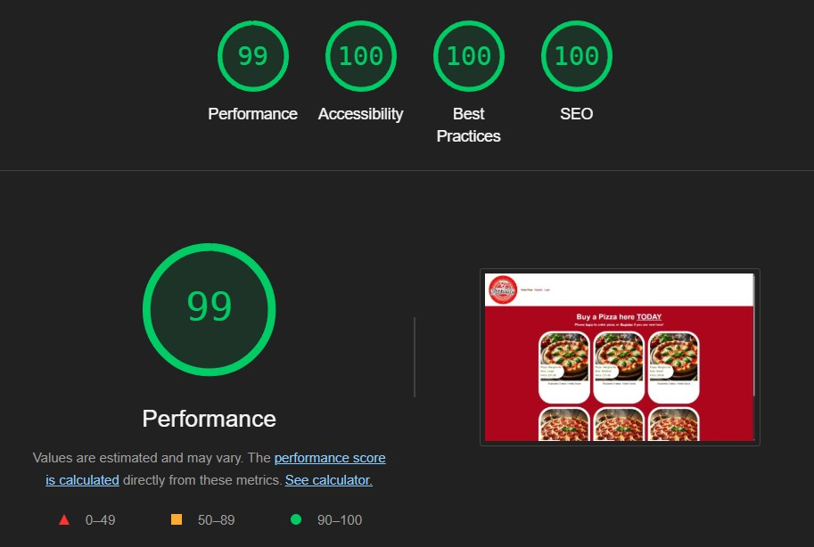
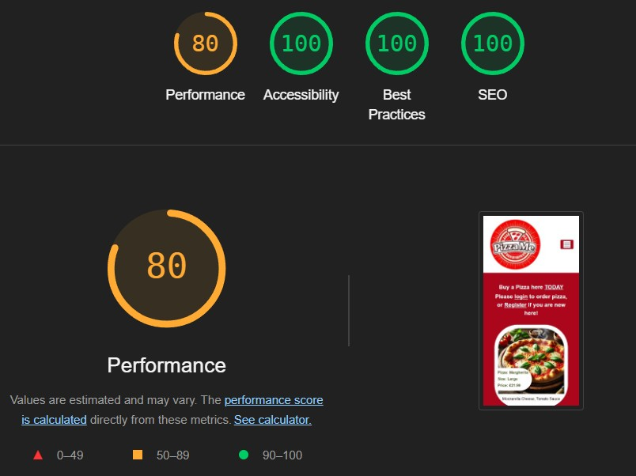
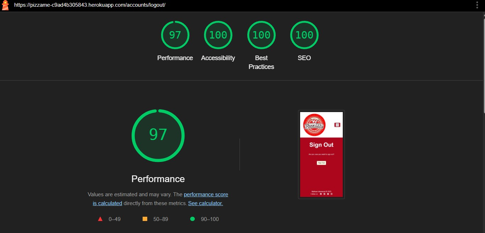

# PizzaVan


Live site: <a href="https://pizzame-c9ad4b305843.herokuapp.com/" target="_blank">PizzaMe!</a>.

For **Admin access** with relevant sign-in information, <a href="https://pizzame-c9ad4b305843.herokuapp.com/admin/" target="_blank">PizzaMe! Admin</a>. 

<a href="https://github.com/MathewIsherwood/PizzaVan" target="_blank">Github repository</a>.

## Table of Contents
1. [Introduction](#introduction)
2. [Overview](#overview)
3. [UX - User Experience](#ux---user-experience)
    - [Design Inspiration](#design-inspiration)
    - [Colour Scheme](#colour-scheme)
    - [Font](#font)
4. [Project Planning](#project-planning)
    - [Strategy Plane](#strategy-plane)
    - [Site Goals](#site-goals)
    - [Agile Methodologies - Project Management](#agile-methodologies---project-management)
    - [Sprints](#sprints)
    - [MoSCoW Prioritization](#moscow-prioritization)
    - [User Stories](#user-stories)
5. [Scope Plane](#scope-plane)
6. [Structural Plane](#structural-plane)
7. [Skeleton & Surface Planes](#skeleton--surface-planes)
    - [Wireframes](#wireframes)
8. [Database Schema - Entity Relationship Diagram](#database-schema---entity-relationship-diagram)
9. [Security](#security)
10. [Features](#features)
    - [User View - Unregistered](#user-view---unregistered)
    - [User View - Registered](#user-view---registered)
    - [Order System & CRUD Functionality](#order-system--crud-functionality)
        - [Create](#create)
        - [Read](#read)
        - [Update](#update)
        - [Delete](#delete)
    - [Confirmation / Notification Messages](#confirmation--notification-messages)
11. [Future Features](#future-features)
12. [Technologies & Languages Used](#technologies--languages-used)
13. [Libraries & Frameworks](#libraries--frameworks)
14. [Tools & Programs](#tools--programs)
15. [Testing](#testing)
  - [Validation Testing](#validation-testing)
16. [Deployment](#deployment)
    - [Pre-Deployment](#pre-deployment)
    - [Cloudinary - Setting Up](#cloudinary---setting-up)
    - [Heroku Notes](#heroku-notes)
    - [Deploying with Heroku](#deploying-with-heroku)
    - [Fork this Repository](#fork-this-repository)
    - [Clone this Repository](#clone-this-repository)
17. [AI](#ai)
    - [Use AI tools to assist in code creation](#use-ai-tools-to-assist-in-code-creation)
    - [Use AI tools to assist in debugging code](#use-ai-tools-to-assist-in-debugging-code)
    - [Use AI tools to optimize code for performance and user experience](#use-ai-tools-to-optimize-code-for-performance-and-user-experience)
    - [Use AI tools to create automated unit tests](#use-ai-tools-to-create-unit-tests)
    - [Reflect on AI’s role in the development process and its impact on workflow](#reflect-on-ais-role-in-the-development-process-and-its-impact-on-workflow)
18. [Privacy Policy](#privacy-policy)
19. [Credits](#credits)
    - [Code](#code)
    - [Media](#media)
    - [Additional reading/tutorials](#additional-readingtutorials)
20. [Acknowledgements](#acknowledgements)

## Overview
PizzaMe is an online platform that allows users to:
- Register and create a profile
- Search for pizza van locations
- Review the pizza orders
- Pre-register interest in orders for a specific day / location

The platform ensures accessibility across all devices and browsers, and its goal is to streamline the process of buying a pizza. In future iterations, PizzaMe will be updated to have more location options, online pre-ordering and talk to the van via messaging.

## UX - User Experience
### Design Inspiration
My inspiration for PizzaMe came from the colours of Pizza, why change what is already a great formula! 

For the business inspiration, there is a pizza van that visits my area but only on a Tuesday. Unless I ask them, I have no idea where in town they are the rest of the week. What if I need a pizza, like medically NEED a pizza on a Friday?! A website is required!

### Colour Scheme


|Tag|Colour|Item(s)|Hex Code|
|---|---|---|---|
|**Primary Color:**|Red|Tomato, Pepper|#f20929|
|**Secondary Color:**|Green|Basil, Pepper|#798539|
|**Accent Color:**|Yellow|Cheddar, Motzeralla|#d2913f|
|**Background:**|Brown|Mushrooms|#ad8875|
|**Font Color:**|Black|Olives|#01000|

#### Accessibility check for colour scheme

Colour Blind Safe and contrast was checked by [Adobe Color](<https://color.adobe.com/create/color-accessibility>)


#### Contrast checker

To check the text contrast I used [Adobe Color](<https://color.adobe.com/create/color-accessibility>)


### Font

Using [Google Font](<https://fonts.google.com/>), I imported "Montserrat" and "Bricolage Grotesque" to my CSS file. I set "Montserrat" as my default font. 
I used "Bricolage Grotesque" as a font for content on my menu page and for authorisation pages.
Aditionally I used "Bodoni Moda" and "Bodoni Moda SC" as highlight fonts.

## Project Planning

### Strategy Plane
The primary objective of PizzaMe is to bridge the gap between people who want pizza and small pizza makers. By offering an intuitive interface, users can easily search for their ideal pizza and pre-order without hassle.

### Site Goals
- Provide customers with a user-friendly platform to book pizzas with PizzaMe.
- Allow PizzaMe to manage their pre-orders and reviews.
- Offer an intuitive interface with role-based dashboards for workers and customers.

### Agile Methodologies - Project Management
I used an agile approach to project management. The PizzaMe development process was broken into sprints, and tasks were added to the GitHub project board to be tracked and managed through issues.
https://github.com/users/MathewIsherwood/projects/5

### Sprints
- **Sprint 1:** Initial Setup - Project, repository, environment setup.
- **Sprint 2:** User Authentication (Task 1)
- **Sprint 3:** Pizza Create Order and View (Tasks 3 and 5)
- **Sprint 4:** Pizza Order Editing (Task 4)
- **Sprint 5:** Pizza Delete (Task 6)
- **Sprint 6:** Notifications (Task 2)
- **Sprint 7:** UI/UX Improvements for multidevice accessibility. 
- **Sprint 8:** Final Deployment & Testing.

### MoSCoW Prioritization
### Must-Haves

1. **User Registration and Login**

    **Acceptance Criteria:**
    - Users can register with a username, email, and password.
    - Users can log in with their credentials.
    - Users receive a confirmation email upon registration.

    **Tasks:**
    - Set up Django AllAuth for user authentication.
    - Create registration and login forms.
    - Implement on screen confirmation for new users.
    - Design responsive registration and login pages.

2. **Notifications**

    **Acceptance Criteria:**
    - Users receive notifications for order status updates.

    **Tasks:**
    - Implement a notification system using Django signals.
    - Create a notifications model.
    - Design a notifications section in the user dashboard.
    - Ensure notifications are displayed responsively.

3. **Create Order**

    **Acceptance Criteria:**
    - Users can create a new order by selecting pizzas and specifying details.
    - Users receive a confirmation message upon successful order creation.

    **Tasks:**
    - Create an order model and form.
    - Implement order creation logic.
    - Design a responsive order creation page.
    - Display a confirmation message upon order creation.

4. **Edit Order**

    **Acceptance Criteria:**
    - Users can edit their existing order.
    - Changes are saved and reflected in the user's order history.

    **Tasks:**
    - Implement order edit functionality.
    - Create a form for editing order.
    - Design a responsive order edit page.
    - Ensure changes are saved and displayed correctly.

5. **View Order**

    **Acceptance Criteria:**
    - Users can view their current and past order.
    - Order details are displayed clearly and responsively.

    **Tasks:**
    - Create a view for displaying user order.
    - Design a responsive order history page.
    - Ensure order details are displayed correctly.

6. **Delete Order**

    **Acceptance Criteria:**
    - Users can delete their existing order.
    - Deleted order are removed from the user's order history.

    **Tasks:**
    - Implement order deletion functionality.
    - Add a delete button to the order history page.
    - Ensure order are removed from the database upon deletion.

### Should-Haves

7. **Reviews**

    **Acceptance Criteria:**
    - Users can leave reviews for their orders.
    - Reviews are displayed on the order details page.

    **Tasks:**
    - Create a review model and form.
    - Implement review submission logic.
    - Design a responsive review section on the order details page.

8. **Edit Reviews**

    **Acceptance Criteria:**
    - Users can edit their existing reviews.
    - Changes are saved and reflected in the review section.

    **Tasks:**
    - Implement review edit functionality.
    - Create a form for editing reviews.
    - Design a responsive review edit page.
    - Ensure changes are saved and displayed correctly.

9. **Filtering Options**

    **Acceptance Criteria:**
    - Users can filter orders and reviews based on various criteria.
    - Filtered results are displayed clearly and responsively.

    **Tasks:**
    - Implement filtering logic for orders and reviews.
    - Create a filtering form.
    - Design a responsive filtering interface.
    - Ensure filtered results are displayed correctly.

10. **Owner - Review Dashboard**

    **Acceptance Criteria:**
    - Owners can view and manage customer reviews.
    - Reviews are displayed in a dashboard format.

    **Tasks:**
    - Create a review dashboard for owners.
    - Implement review management functionality.
    - Design a responsive review dashboard.
    - Ensure reviews are displayed and managed correctly.

11. **Owner - Orders Dashboard**

    **Acceptance Criteria:**
    - Owners can view and manage incoming orders.
    - Orders are displayed in a dashboard format.

    **Tasks:**
    - Create an orders dashboard for owners.
    - Implement order management functionality.
    - Design a responsive orders dashboard.
    - Ensure orders are displayed and managed correctly.

### Could-Haves

12. **Profile Pictures for Users and Staff**

    **Acceptance Criteria:**
    - Users and staff can upload profile pictures.
    - Profile pictures are displayed on their profiles.

    **Tasks:**
    - Implement profile picture upload functionality.
    - Create a form for uploading profile pictures.
    - Design a responsive profile picture section.
    - Ensure profile pictures are displayed correctly.

13. **Messaging System**

    **Acceptance Criteria:**
    - Users can send and receive messages within the platform.
    - Messages are displayed in a messaging interface.

    **Tasks:**
    - Implement a messaging system.
    - Create a messaging model and form.
    - Design a responsive messaging interface.
    - Ensure messages are sent and received correctly.

14. **Personal Profile with Pre-Planned Filters (Allergies, Distastes)**

    **Acceptance Criteria:**
    - Users can set preferences for allergies and distastes.
    - Preferences are used to filter available pizzas.

    **Tasks:**
    - Implement preference setting functionality.
    - Create a form for setting preferences.
    - Design a responsive preferences section.
    - Ensure preferences are used to filter pizzas correctly.

15. **Changing / Removing Toppings**

    **Acceptance Criteria:**
    - Users can customize their pizzas by changing or removing toppings.
    - Customizations are reflected in the order details.

    **Tasks:**
    - Implement topping customization functionality.
    - Create a form for customizing toppings.
    - Design a responsive customization interface.
    - Ensure customizations are saved and displayed correctly.

16. **Changing Crusts**

    **Acceptance Criteria:**
    - Users can customize their pizzas by changing the crust.
    - Customizations are reflected in the order details.

    **Tasks:**
    - Implement crust customization functionality.
    - Create a form for customizing crusts.
    - Design a responsive customization interface.
    - Ensure customizations are saved and displayed correctly.

17. **Order History**

    **Acceptance Criteria:**
    - Users can view their past orders.
    - Order history is displayed clearly and responsively.

    **Tasks:**
    - Create a view for displaying order history.
    - Design a responsive order history page.
    - Ensure past orders are displayed correctly.

18. **Saved Orders**

    **Acceptance Criteria:**
    - Users can save their favorite orders for quick reordering.
    - Saved orders are displayed in a saved orders section.

    **Tasks:**
    - Implement saved orders functionality.
    - Create a form for saving orders.
    - Design a responsive saved orders section.
    - Ensure saved orders are displayed and managed correctly.

19. **Reset Password (Requires Email or SMS Integration)**

    **Acceptance Criteria:**
    - Users can reset their password using email or SMS.
    - Password reset instructions are sent to the user's email or phone.

    **Tasks:**
    - Implement password reset functionality.
    - Integrate email or SMS for password reset.
    - Design a responsive password reset page.
    - Ensure password reset instructions are sent correctly.

20. **Add Photo onto Review**

    **Acceptance Criteria:**
    - Users can add photos to their reviews.
    - Photos are displayed alongside the review.

    **Tasks:**
    - Implement photo upload functionality for reviews.
    - Create a form for adding photos to reviews.
    - Design a responsive photo section in the review.
    - Ensure photos are displayed correctly with the review.

## User Stories
### Guest User Stories (Users Without an Account)

- As a guest, I want to `browse the pizzas`, so I can see what pizzas are available.
- As a guest, I want to `sign up` easily, so I can place an order without hassle.

### Customer User Stories (Users logged in)

- As a customer, I want to order `multiple pizzas` at once, so I can buy food for my family or group.
- As a customer, I want to receive an `order confirmation`, so I know my order was successfully placed.
- As a customer, I want to `order a single pizza`, just for me.
- As a customer, I want to be able to `edit my order`, got to be able to change my mind!
- As a customer, I want to be able to `delete my order`, changed my mind!

## Admin (Business Owner) User Stories
- As an admin, I want to `view and manage incoming orders`, so I can prepare them efficiently.
- As an admin, I want to update `order status` so customers know when their pizza is ready.

## Flow Diagram


## Scope Plane

The PizzaMe platform will include the following MVP functionalities:
- User registration and role-based dashboards.
- Search and filtering system

## Structural Plane
The site is structured around an easy-to-use interface. The primary menu includes links to orders and user profile management.

## Skeleton & Surface Planes

### Wireframes
Wireframes were created for the following key pages to ensure an intuitive user journey:

<details open>
    <summary>Wireframe - Main Page (Index Page) - Over Multiple Devices</summary>  
     
</details>
<details>
    <summary>Wireframe - Find Pizza Page</summary>  
     
</details>
<details>
    <summary>Wireframe - Order Pizza Page - Logged In</summary>  
     
</details>
<details>
    <summary>Wireframe - Order Pizza Page - Logged Out</summary>  
     
</details>
<details>
    <summary>Wireframe - Reviews Page</summary>  
     
</details>
<details>
    <summary>Wireframe - Specials Page</summary>  
     
</details>
<details>
    <summary>Wireframe - Register Page</summary>  
     
</details>
<details>
    <summary>Wireframe - Login / Logout Page</summary>  
     
</details>

Wireframes were designed using [Balsamiq](https://balsamiq.com/), ensuring responsiveness across devices. Wireframes include all MoSCoW Prioritization levels.

## database schema - entity relationship diagram

- user (customers & admins)

> - id (autofield): [primary key]
> - username (charfield)
> - first_name (charfield)
> - last_name (charfield)
> - email (emailfield)
> - password (charfield)
> - is_staff (booleanfield)
> - is_active (booleanfield)
> - date_joined (datetimefield)

- order

> - id (pk) (integer)
> - user_id (fk → user) (integer)
> - order_date (timestamp)
> - status (varchar(9)) - example (Pending, Preparing, Delivered, Cancelled)
> - total_price (float)
> - forward_order (boolean)
> - forward_order_time (timestamp)

- pizza

> - id (pk)(integer)
> - name (varchar(100))
> - size (varchar(6)) - example (Small, Medium, Large)
> - price (float)
> - description (varchar(100))
> - featured_image (varchar(100))
> - enabled (boolean)

orderitem (many-to-many between order & pizza)

> - id (pk) (integer)
> - order_id (fk → order) (integer)
> - pizza_id (fk → pizza) (integer)
> - quantity (integer)

- payment

> - id (pk) (integer)
> - order_id (fk → order) (integer)
> - payment_method (varchar(12)) - example (Credit Card, Paypal, Cash)
> - payment_status (varchar(8)) - example (Paid, Pending, Failed)


The above ERD was generated using https://dbdiagram.io/

~~~
Table userAllauth {
id (AutoField): [primary key]
username (CharField): [note:'Required. 150 characters or fewer. Usernames may contain alphanumeric, _, @, +, . and - characters.']
first_name (CharField): [note:'Optional. 150 characters or fewer.']
last_name (CharField): [note:'Optional. 150 characters or fewer.']
email (EmailField): [note:'Optional. 254 characters or fewer.']
password (CharField): [note:'Required. A hashed representation of the user's password.']
is_staff (BooleanField): [note:'Designates whether the user can log into the admin site.']
is_active (BooleanField): [note:'Designates whether this user should be treated as active.']
date_joined (DateTimeField): [note:'The date and time when the user account was created.']
}

Table order{
ID Integer [primary key]
User_ID Integer [note:'(FK → User)']
Order_date timestamp
Status varchar(9) [note: 'Pending, Preparing, Delivered, Cancelled']
Total_price Float
Forward_order boolean
Forward_order_time timestamp
}

Table pizza {
ID integer [primary key]
Name varchar(100)
Size varchar(6) [note: 'Small, Medium, Large']
Price Float
Description varchar(100)
featured_image varchar(100)
enabled boolean
}

Table orderItem {
ID Integer [primary key]
Order_ID Integer [note:'(FK → Order)']
Pizza_ID Integer [note:'(FK → Pizza)']
Quantity Integer
}

Table payment {
ID Integer [primary key]
Order_ID Integer [note:'(FK → Order)']
Payment_method varchar(12) [note: 'Credit Card, PayPal, Cash']
Payment_status varchar(8) [note: 'Paid, Pending, Failed']
}

Ref: userAllauth.ID < order.User_ID
Ref: orderItem.Order_ID > order.ID
Ref: orderItem.Pizza_ID > pizza.ID
Ref: payment.Order_ID - order.ID
~~~

## Security
All data is securely handled with Django’s security features, including:
- CSRF protection for form submissions.
- Data encryption for sensitive information like passwords using Django's built-in authentication.
- Role-based access control to restrict sensitive data to authorized users.

Role-based access control (RBAC) is implemented using Django's Permission systems. `Customers` and `Admins` are grouped based on their role, and their access to sensitive information is restricted accordingly.  `Admins` have the broadest access for system management through the admin panel. `Customers` can access their own orders through the my_orders page. `Guest/Visitors` can only see the products.

## Pizza Booking System

### Confirmation Messages
- **User Feedback**: Confirmation messages are shown to users when important actions are performed, such as logging in, booking a pizza, editing a pizza or deleting a pizza. These messages help ensure a smooth user experience by providing feedback on successful actions.

### CRUD Functionality
- The user can implement `C U and D` on the `order` pizza page and `R` is implemented on the `my orders` page.

## Features

- ### User View - Unregistered
Logged Out Order Page

Logged Out Sign Up Page

Logged Out Sign In Page


- ### User View - Registered
Logged In Order Page With Items

Logged In Order Page Without Items

Logged In Sign Out Page


- ### Order System & CRUD Functionality
- #### Create 

- #### Read

- #### Update

- #### Delete


- ### Confirmation / Notification Messages


## Future Features
I plan to implement the following in future iterations:
- Push notifications for upcoming site visits near my location.
- Integrate a payment system for the Pizza's.
- Give the admin and customer more functionality such as being able to review a Pizza.
- Add a review section for the pizzas.
- Add a contact section for people to contact the owners.

## Technologies & Languages Used
- HTML5 - Markup language for structuring the website
- CSS3 - Styling language for designing the layout and visual aesthetics
- JavaScript - For interactivity and DOM manipulation on the frontend
- Python (Django) - Backend web framework for server-side logic and management
- PostgreSQL - Database management system for storing data
- Cloudinary - Cloud-based image storage solution
- Whitenoise - For serving static files directly from Django
- Heroku - For online hosting of website

## Libraries & Frameworks
- **Django** - Backend framework
- **Django Crispy Forms** - For elegant form rendering
- **Cloudinary** - Media storage
- **Whitenoise** - For serving static files

## Tools & Programs
- **GitHub Projects** - Project management and tracking
- **Heroku** - Deployment and hosting
- **Balsamiq** - Wireframes and design prototypes

## **Testing**

|Page|Feature|Action|Effect|Success?|
|---|---|---|---|---|
|Homepage|Site Logo|Click|Attempts to load order page, but you are already on it, refreshes page|&#x2713;|
|Homepage|Order Pizza Link|Click|Attempts to load order page, but you are already on it, refreshes page|&#x2713;|
|Homepage|Register Link|Click|Redirects to Register/Sign Up Page|&#x2713;|
|Homepage|Login Link|Click|Redirects to Sign In Page|&#x2713;|
|Homepage|My Orders Link|Click|Redirects to My Orders Page|&#x2713;|
|Homepage|Order Link|Click|Creates an order for that Pizza x 1|&#x2713;|
|Homepage|Update Button|Click|Updates the Pizza quantity to the one put inside the box|&#x2713;|
|Homepage|Delete Link|Click|Deletes that Pizza from the order|&#x2713;|
|Homepage|Next Link|Click|Shows the next page of Pizzas|&#x2713;|
|Homepage|Previous Link|Click|Goes to the previous page of Pizzas|&#x2713;|
|Homepage|Logout link|Click|Redirects to confirm signout page|&#x2713;|
|Homepage|Update Quantity Form Data Blank| Delete number| Error Message Shown|&#x2713;|
|Homepage|Update Quantity Form Data Correct | Change Number | Success Message Shown|&#x2713;|
|Homepage|Call-to-Action login button|Click|Redirects to Login Page|&#x2713;|
|Homepage|Edit Button|Logged out|Not visible|&#x2713;|
|Homepage|Edit Button|Logged in : click|Visible - edits the Pizza value to the new number|&#x2713;|
|Homepage|Message on login|Login as user|Successful Signin message appears, X to clear|&#x2713;|
|Homepage|Message on logout|Logout|Successful signout message appears, X to clear|&#x2713;|
|Register Page|Site Logo|Click|Redirects to pizza order page from all pages|&#x2713;|
|Register Page|Order Pizza Link|Click|Loads the main page / order Pizza page|&#x2713;|
|Register Page|Login Link|Click|Redirects to Sign In Page|&#x2713;|
|Register Page|Register Link|Click|Attempts to redirect to Register/Sign Up Page, but you are already on it so it refreshes the page.|&#x2713;|
|Register Page|Username validation|Try using existing username|Error message appears - 'A user with that username already exists'|&#x2713;|
|Register Page|email validation|Entered invalid email (without '@'|Error message - 'Please enter valid email address' and registration fails|&#x2713;|
|Register Page|password1|Enter a short password|Error message - 'That password is too short'|&#x2713;|
|Register Page|password2|Enter different password to password1 field|Error message - 'You must type the same password each time'|&#x2713;|
|Register Page|Sign Up button|Entered valid form data|Redirects to home page - success message displayed|&#x2713;|
|Login Page|Site Logo|Click|Redirects to pizza order page from all pages|&#x2713;|
|Login Page|Order Pizza Link|Click|Loads the main page / order Pizza page|&#x2713;|
|Login Page|Forgot Your Password Link|Click|Loads the forgotten password page|&#x2713;|
|Login Page|Sign In Button|Fill  out Username and Password, Click Sign In|Redirect to Order Page logged in|&#x2713;|
|Login Page|Username validation|Enter incorrect username|Error message response - does not specify if username or password failed|&#x2713;|
|Login Page|Password validation|Enter incorrect password|Error message response - does not specify if username or password failed|&#x2713;|
|Login Page|Remember me button|Checkbox on|Close browser window and reopen - user still logged in|&#x2713;|
|Login Page|Sign in button|Click|Redirects to home page, shows successful login message|&#x2713;|
|Logout Page|Site Logo|Click|Redirects to pizza order page from all pages|&#x2713;|
|Logout Page|Order Pizza Link|Click|Loads the main page / order Pizza page|&#x2713;|
|Logout Page|My Orders Link|Click|Redirects to My Orders Page|&#x2713;|
|Logout Confirm Popup|Sign Out button|Click|Redirects to home page, user logged out|&#x2713;|

### Examples of completed tests


### **Validation Testing**

All code has been validated through:
- **HTML**: [W3C Markup Validator](https://validator.w3.org/).
- **CSS**: [W3C CSS Validator](https://jigsaw.w3.org/css-validator/).
- **Python**: PEP8 validation to ensure code quality inside `VSCode` with `Flake8`
- **Lighthouse**: Validated to below my standards on mobile performance. If I was using a paid plan of Cloudinary and/or Heroku these scores would be better than shown.

### Main Page
#### Desktop


#### Mobile



- These issues are because of Heroku and Cloudinary being on a free package and thus taking longer than desired for the scanners rankings. The score you get for mobile may be more favourable or less depending on location and time of day. I have attempted to adjust for this impact with Lazyload and other optimisation changes which are reflected in the Desktop score above.

### Register Page
#### Desktop

#### Mobile


### Login Page
#### Desktop

#### Mobile


### My Orders Page
#### Desktop

#### Mobile


### Logout Page
#### Desktop

#### Mobile


## Deployment

All code for this project was written in Visual Studio as the integrated development environment. GitHub was used for version control, and the application was deployed to Heroku from GitHub with Cloudinary as hosting for the files.

### Pre-Deployment

### Cloudinary - Setting Up
1. Navigate to www.cloudinary.com, and click the Sign Up for Free button. Create a new account.
2. Click on Create Account, and click the link in the verification email that you'll be sent.
3. On the Dashboard, copy the API Environment variable somewhere safe - this must be added to the Heroku
configuration variables in the next section and in your env.py file.

### Heroku Notes

To ensure a successful deployment to Heroku, the following practices are to be followed:

- **Requirements File:** The `requirements.txt` file must be kept up to date to ensure all imported Python modules are configured correctly for Heroku.
- **Procfile:** A `Procfile` was added to configure the application as a Gunicorn web app on Heroku.
- **Allowed Hosts:** In `settings.py`, the `ALLOWED_HOSTS` list was configured to include the Heroku app name and `localhost`. Example format:
    ```python
    ALLOWED_HOSTS = ['your-app-name.herokuapp.com', 'localhost']
    ```
- **Environment Variables:** All sensitive data such as the `DATABASE_URL`, `CLOUDINARY_URL`, and `SECRET_KEY` are added to the `.env` file, which is ignored by Git using `.gitignore`. These variables are added to Heroku manually through the Config Vars section.

### Deploying with Heroku

The steps for deploying to Heroku are as follows (Experience from previous Django projects):

1. **Create New App:** Log in to your Heroku account and click on the "Create New App" button.
2. **App Name:** Choose a unique name for your app.
3. **Select Region:** Choose the appropriate region (Europe was selected for this project).
4. **Create App:** Click the "Create App" button to proceed.
5. **Deployment Method:** In the "Deploy" tab, select GitHub as the deployment method.
6. **Connect to GitHub:** Search for the repository name and click "Connect".
7. **Manual or Automatic Deployment:** Select either manual or automatic deployment. Ensure the main branch is selected for deployment.
8. **Config Vars:** In the "Settings" tab, click "Reveal Config Vars" and input the required environment variables.
9. **Buildpack:** Select Node.js and Python as the buildpacks for your project.
10. **Deploy:** Once the configuration is complete, click the "Deploy Branch" button. After successful deployment, a "View" button will appear to take you to the live site.

The live link for this project can be found here: <a href="https://pizzame-c9ad4b305843.herokuapp.com/" target="_blank">PizzaMe!</a>

### Fork this Repository

1. Go to the GitHub repository.
2. Click the "Fork" button in the upper right-hand corner.

### Clone this Repository

1. Go to the GitHub repository.
2. Click the "Code" button at the top of the page.
3. Choose between 'HTTPS', 'SSH', or 'GitHub CLI' depending on your preference.
4. Click the copy button to copy the URL.
5. Open Git Bash.
6. Change the working directory to where you want to clone the directory.
7. Type:
    ```bash
    git clone https://github.com/MathewIsherwood/PizzaVan
    ```
8. Press Enter to create the local clone.

**Note:** The difference between a clone and a fork is that with a clone, you need permission to push changes to the original repository, whereas a fork creates an entirely new project under your GitHub account.

## AI
### Use AI Tools to Assist in Code Creation
AI tools, such as GitHub Copilot and ChatGPT, were utilized to generate code snippets aligned with project requirements. These tools helped streamline the development process by providing suggestions for repetitive tasks, boilerplate code, and complex logic implementations. The generated code was reviewed and adjusted to ensure it met the project’s standards and functionality. Sometimes my lack of knowledge about code suggested led me down a fruitless hole which I had to revert out of, for example it was suggested I use a counter in **with** by Copilot, but I didn't know that Django templates didn't allow that. On the whole the use of AI was positive for the project.
On a positive note, when my functions and classes were becoming more complicated (my `views.py`) the AI suggestions generally improved my ability to develop changes without hitting errors. 

### Use AI Tools to Assist in Debugging Code
AI tools were employed to identify and resolve bugs efficiently. By analyzing error messages and suggesting potential fixes, these tools reduced debugging time and improved code reliability. Key interventions included resolving syntax errors (missing : ; etc), optimizing database queries, and addressing edge cases. AI also helped clean my code to pass PEP8.

### Use AI Tools to Optimize Code for Performance and User Experience
AI-driven suggestions were used to enhance code performance and improve user experience. This included optimizing database queries, and refining UI/UX elements. The AI recommendations were evaluated and implemented selectively to ensure they aligned with project goals. This helped me not stray too far in the `views.py` and focus on bringing over only the neccesarry data. This was especially helpful in `order_pizza` when the if statements started to build up.

### Use AI Tools to Create Unit Tests
GitHub Copilot was leveraged to generate Django unit tests for key application features in the manual test table. These tests ensured adequate code coverage and validated the functionality of critical components. The generated tests were reviewed and modified as needed to improve accuracy and completeness and then used for manual testing. The good thing about co-writing these with the AI is that it gave me different ideas of what to test than what I had initially put down. Some of the tests it suggested were wrong but I removed them from the pool. AI, whilst being an amazing resource isn't 100% correct at this time.

### Reflect on AI’s Role in the Development Process and Its Impact on Workflow
AI tools significantly enhanced the development workflow by increasing efficiency and reducing repetitive tasks. They provided valuable detailed insights during debugging, optimized performance by removing the unneccsary, and facilitated the creation of robust manual tests. The integration of AI tools allowed me to focus on higher-level problem-solving and innovation, ultimately improving the overall quality of the project. Despite not getting as much finished as I wanted, this was my fault being new at `Django` rather than my use of AI on the project. During the whole project the AI had a variety of different impacts, the major impact was during code creation and debugging. However I did use AI throughout if I wanted to query something or to have something explained.

## Privacy Policy
As part of the **PizzaMe!** project, I was dedicated to ensuring that users’ personal data is handled responsibly. The following privacy practices outline how information is collected, used, and stored within this academic project.

- **Data Collection**: PizzaMe!, as a project, collects very little personal data during user registration. This includes:
  - Username (Can be anything, doesn't have to be a name)
  - E-Mail Address (Optional)
  - Password

- **Data Sharing**: As this is a student project, personal data will not be shared with any third parties. It will only be used for demonstrating the functionality of the project. All information remains confidential and will not be distributed beyond the scope of the PizzaMe! project.

- **Security**: While this project is intended for educational use, I strive to implement best practices for data security using the Django framework’s built-in tools, particularly in using the . Personal information is securely stored in the database and protected against unauthorized access.

- **User Rights**: Users of this platform, as part of this project, have the right to request modifications or deletion of their data. For any requests or concerns about personal data usage in this project, please contact me on github.

Since this is an educational project, the privacy and data handling policies may evolve over time as more features are added and refined.

## Credits

### Code
- **Django Documentation**: The official docs were helpful as were the files provided by Code Institute and Alex (our tutor) for setting up the project structure and solving specific issues.
- **Django Crispy Forms Documentation**: Initially I used to streamline form rendering but due to cutbacks in the project to fit the project into the time allowed I remvoed its usage with what was implemented.
- **Chatgpt AI**: For images and some coding ideas.
- **Copilot AI**: For code debugging, suggestions and for taking me on wild goose chases such as including a  *with* then after half an hour of debugging telling me that Django doesn't allow *with* to carry that value over in that way.
- **tinypng.com**: For optimisation of the image file size for delivery.
- **imageresizer.com**: For optimising the image size on the wbesite for placement.
- **Google Fonts**: For typography.
- **HealMate**: A student project that passed this course, I used elements of it's readme file for structuring my own.
- **Hata-na-tata**: A student project that passed this course, I used elements of it's readme file for structuring my own.
- **John Rearden** - Code Institute: For general guidance and coding advice.
- **Alexander Tastad** - Code Institute: For general guidance and paperwork assistance.

### Media
- Icons and images sourced from **ChatGPT**.
- ERD illustration was generated from [dbdiagram.io](https://dbdiagram.io/)

### Additional reading/tutorials
- [W3Schools](https://www.w3schools.com/) was used for example finding when the LMS (which doesn't have a search bar) examples couldn't be found. 

## Acknowledgements 
I wish to thank many people for helping me finish this project including **Mark Randall**, **Hannah Mooney**, **Aaron Ibbotson** and **David Coles**. Whose support, guidance and assistance were critical in helping me finish the project in time.

### Academic Institutions
- **Code Institute** – Thank you for providing the learning environment and resources that made this project possible. I am especially grateful to the professors and staff at Code Institute for their valuable insights, especially through the coding coach sessions. 

### Final Note
This was a difficult project, especially considering how much I had to cut it back due to issues during coding. There remains a full plan in place to implement those features but unfortunately there won't be time to do them for this project. Thank you to all those named above and others for their help in getting me through to the finish.


from django.core.management.utils import get_random_secret_key
print(get_random_secret_key())